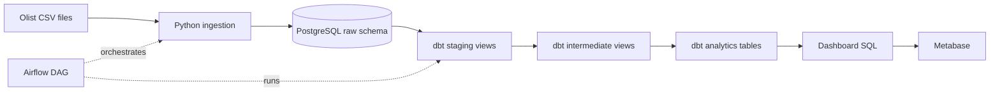

# Architecture

## Overview

The project is a local batch analytics platform. Airflow coordinates ingestion,
validation, and transformation. PostgreSQL is both the landing warehouse and
the analytical database. dbt owns transformations after raw ingestion, while
Metabase reads only the final analytics models.



## Runtime Components

| Component | Responsibility |
| --- | --- |
| `warehouse-postgres` | Stores source tables in `raw` and dbt models in `analytics` |
| `airflow-postgres` | Stores Airflow metadata; it does not contain business data |
| `airflow-init` | Runs metadata migrations and creates the local authentication file |
| `airflow-api-server` | Serves the Airflow UI, API, and task execution API |
| `airflow-scheduler` | Schedules DAG tasks and executes them with `LocalExecutor` |
| `airflow-dag-processor` | Parses and serializes DAG definitions |
| Metabase | Connects to the warehouse and renders analytics queries |

All Airflow services use the same Docker image, project mount, database
configuration, API secret, and JWT secret.

## Airflow Communication

Airflow 3 task workers register task state through the Execution API:

```text
airflow-scheduler
    → http://airflow-api-server:8080/execution/
```

`AIRFLOW_EXECUTION_API_SERVER_URL` must use the Docker service name rather than
`localhost`. The API and JWT secrets must be identical across Airflow services.
Without this configuration, a task can fail before its hostname is recorded,
which also prevents the UI from retrieving its served logs.

With `LocalExecutor`, task processes run inside the scheduler container. The API
server reads their logs through the scheduler's worker log server.

## Storage Boundaries

The warehouse contains two business-data schemas:

- `raw`: nine source-shaped tables whose columns are stored as text
- `analytics`: dbt staging views, intermediate views, dimensions, and facts

Raw CSV files remain under `data/raw/olist/` and are excluded from Git. There is
no `data/processed/` layer because processed data is materialized in PostgreSQL.

Docker named volumes persist:

- warehouse data
- Airflow metadata
- Metabase application data

## Transformation Ownership

Responsibilities are deliberately separated:

- Python creates raw tables, loads CSV files, and validates source integrity.
- dbt cleans types, enriches entities, builds reporting models, and tests them.
- Airflow defines task order and run state but contains no transformation logic.
- Dashboard SQL calculates presentation-specific metrics from dbt marts.

## Materialization Strategy

| Layer | Materialization | Purpose |
| --- | --- | --- |
| Raw | PostgreSQL tables | Preserve source-shaped records |
| Staging | dbt views | Clean values and cast data types |
| Intermediate | dbt views | Reuse enriched order-level logic |
| Marts | dbt tables | Provide stable reporting performance |

## Operational Constraints

- The DAG has no schedule because the Olist files are static.
- `max_active_runs=1` prevents concurrent full refreshes.
- Raw table creation uses `CREATE TABLE IF NOT EXISTS`.
- Loading truncates and reloads raw tables in one database transaction.
- A failed raw-data check prevents dbt from running.
- A failed dbt model or test causes `dbt build` and the DAG to fail.
