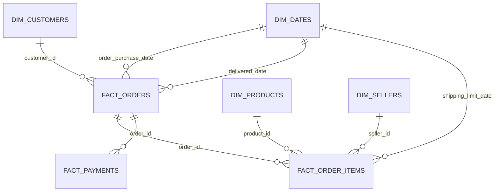

# Data Model

## Schemas and Layers

The warehouse uses the `raw` schema for ingestion and the `analytics` schema for
all dbt models.

| Layer | Objects | Grain |
| --- | --- | --- |
| Raw | 9 tables | Same grain as source CSV files |
| Staging | 9 views | Same grain as raw tables |
| Intermediate | 2 views | Orders and order items enriched for reuse |
| Marts | 7 tables | Reporting dimensions and facts |

## Raw Sources

Raw columns are intentionally stored as `TEXT`. This keeps ingestion simple and
makes dbt responsible for cleaning and casting.

| Raw table | Primary grain |
| --- | --- |
| `raw.customers` | One row per `customer_id` |
| `raw.geolocation` | One row per source geolocation record |
| `raw.order_items` | One row per order and item sequence |
| `raw.order_payments` | One row per order and payment sequence |
| `raw.order_reviews` | One row per source review record |
| `raw.orders` | One row per order |
| `raw.products` | One row per product |
| `raw.sellers` | One row per seller |
| `raw.product_category_name_translation` | One row per Portuguese category |

## Staging Models

Each source has one staging view:

- `stg_customers`
- `stg_geolocation`
- `stg_order_items`
- `stg_order_payments`
- `stg_order_reviews`
- `stg_orders`
- `stg_products`
- `stg_sellers`
- `stg_product_category_name_translation`

Staging models trim strings, convert empty strings to `NULL`, cast dates and
numeric values, and correct the source spelling of product length fields.

## Intermediate Models

### `int_orders_enriched`

Grain: one row per order.

Combines orders with customer location, aggregated payment totals, payment
counts, average review score, and review counts.

### `int_order_items_enriched`

Grain: one row per order item.

Combines order items with product attributes, translated category names, and
seller location.

## Analytics Marts

| Model | Grain | Key | Purpose |
| --- | --- | --- | --- |
| `dim_customers` | One row per customer record | `customer_id` | Customer location and order summary metrics |
| `dim_products` | One row per product | `product_id` | Product attributes and English category |
| `dim_sellers` | One row per seller | `seller_id` | Seller location |
| `dim_dates` | One row per calendar date | `date_day` | Date attributes for reporting |
| `fact_orders` | One row per order | `order_id` | Status, payment, review, and delivery metrics |
| `fact_order_items` | One row per order item | `order_item_key` | Product revenue and freight |
| `fact_payments` | One row per payment sequence | `payment_key` | Payment method and value |

## Mart Relationships



## Important Metrics

### Revenue

Dashboard revenue is the sum of `fact_order_items.price` for delivered orders.
Freight is reported separately. Customer spend is:

```text
price + freight_value
```

### Order Value

`fact_orders.total_payment_value` is aggregated from source payment records.
Dashboard average order value based on merchandise uses item price divided by
distinct delivered orders.

### Delivery Duration

`fact_orders.delivery_days` is the number of days between purchase timestamp and
customer delivery timestamp. It is null for orders without a delivery timestamp.

### Review Score

`fact_orders.average_review_score` is the average of source review rows for an
order. Category-level analysis first deduplicates order-category combinations
to avoid weighting an order multiple times for repeated items.

## Data Quality

dbt tests cover:

- non-null identifiers and required attributes;
- uniqueness of dimensions and fact keys;
- relationships from facts to dimensions;
- source-level required values and unique identifiers.

The dbt project currently defines 89 tests across 9 sources and 18 models.
